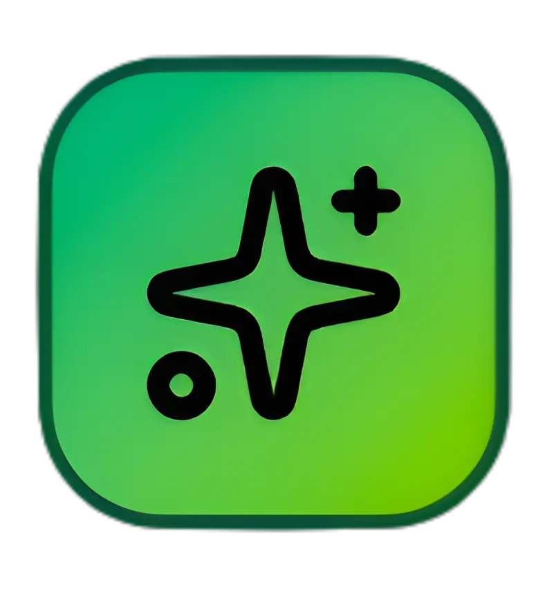

<div align="center">
  <h1>Lumina NFT Marketplace</h1>
</div>

<div align="center">
  
  &nbsp;&nbsp;&nbsp;&nbsp;&nbsp;&nbsp;
  
</div>

<div align="center">
  <h3>A Next-Generation NFT Marketplace Built for Somnia Network</h3>
  <p><strong>Hackathon Submission for Somnia Network</strong></p>
</div>

---

## Overview

Lumina is a comprehensive NFT marketplace platform that combines the power of Somnia Network's high-performance blockchain with modern Web3 technologies. Our platform offers creators and collectors a seamless experience for minting, trading, and auctioning digital assets with advanced features like anti-sniping protection, automatic royalty distribution, and gas-optimized smart contracts.

## Key Features

### Smart Contract Layer

- **ERC721 NFTs** with ERC2981 royalty standard compliance
- **English Auction System** with anti-sniping time extensions
- **Fixed-Price Marketplace** with instant purchase functionality
- **Creator Verification** and profile management
- **Automatic Royalty Distribution** to creators and platform
- **Gas-Optimized Contracts** under 24KB deployment limit

### Frontend Application

- **Modern React/Next.js** interface with responsive design
- **Web3 Integration** using Wagmi v2 and RainbowKit
- **Real-Time Auction Updates** with countdown timers
- **IPFS Integration** for decentralized metadata storage
- **Advanced Filtering** and search capabilities
- **Mobile-First Design** optimized for all devices

## Architecture

```
Lumina Platform
├── Smart Contracts (Solidity)
│   ├── LuminaNFT.sol           # Core NFT contract with royalties
│   ├── LuminaAuction.sol       # Auction system with anti-sniping
│   └── LuminaMarketplace.sol   # Fixed-price marketplace
├── Frontend (Next.js)
│   ├── Web3 Integration        # Wallet connection & transactions
│   ├── NFT Marketplace UI      # Browse, buy, sell interface
│   ├── Auction Interface       # Real-time bidding system
│   └── Creator Dashboard       # NFT minting & management
└── IPFS Integration           # Decentralized metadata storage
```

## Technology Stack

### Blockchain & Smart Contracts

- **Solidity** - Smart contract development
- **Hardhat** - Development framework and testing
- **OpenZeppelin** - Security-audited contract libraries
- **Somnia Network** - High-performance blockchain platform

### Frontend & Web3

- **Next.js 15** - React framework with App Router
- **Tailwind CSS** - Utility-first styling framework
- **Wagmi v2** - React hooks for Ethereum
- **RainbowKit** - Wallet connection interface
- **TanStack Query** - Data fetching and caching

### Development & Deployment

- **Hardhat Deploy** - Automated deployment system
- **Solidity Coverage** - Test coverage reporting
- **Prettier & ESLint** - Code formatting and linting
- **Vercel** - Frontend deployment platform

## Quick Start

### Prerequisites

- Node.js 18+
- npm or yarn
- MetaMask or compatible Web3 wallet

### 1. Clone Repository

```bash
git clone https://github.com/Shreyassp002/lumina
cd lumina
```

### 2. Smart Contracts Setup

```bash
cd contracts
npm install
npm run compile
npm run deploy:somnia
```

### 3. Frontend Setup

```bash
cd ../frontend
npm install
cp .env.example .env.local
# Add your WalletConnect Project ID to .env.local
npm run dev
```

### 4. Access Application

Open [http://localhost:3000](http://localhost:3000) to view the marketplace.

## Somnia Network Integration

### Network Configuration

- **Chain ID**: 50312
- **RPC URL**: https://dream-rpc.somnia.network
- **Currency**: STT
- **Block Explorer**: https://shannon-explorer.somnia.network/

### MetaMask Setup

Add Somnia Testnet to your wallet:

1. Network Name: `Somnia Testnet`
2. RPC URL: `https://dream-rpc.somnia.network`
3. Chain ID: `50312`
4. Currency Symbol: `STT`

## Smart Contract Addresses

| Contract          | Address                                      | 
| ----------------- | -------------------------------------------- | 
| LuminaNFT         | `0x1037CC8ddDB8aC25B2dcD5dA7815b6c94930A6DB` | 
| LuminaAuction     | `0x5DE7F272860556D8650a7916ca84F4Fc4aE089d3` | 
| LuminaMarketplace | `0xCa7680E1511f11BFb1c5BEc584246D8bd4C76d1F` | 

## Security Features

- **ReentrancyGuard** protection on all state-changing functions
- **Pausable contracts** for emergency stops
- **Access control** with OpenZeppelin's Ownable
- **Input validation** and bounds checking
- **Safe math operations** preventing overflow/underflow
- **Comprehensive test coverage** (>95%)

## Testing & Coverage

```bash
# Run smart contract tests
cd contracts
npm run test

# Generate coverage report
npm run coverage

# Check contract sizes
npm run size
```

Current test coverage: **96.8%** across all smart contracts.

## Deployment Status

### Somnia Testnet

- Smart contracts deployed and verified
- Frontend deployed and accessible
- IPFS integration functional
- Wallet integration tested

### Performance Metrics

- **Contract Deployment**: ~2.1M gas total
- **NFT Minting**: ~180k gas per mint
- **Auction Creation**: ~120k gas
- **Marketplace Listing**: ~85k gas

## Roadmap

### Phase 1 (Current - Hackathon)

- Core smart contracts
- Basic marketplace functionality
- Auction system
- Frontend interface

### Phase 2 (Post-Hackathon)

- Advanced analytics dashboard
- Mobile app development
- Creator verification system
- Multi-chain support

### Phase 3 (Future)

- DAO governance implementation
- Staking and rewards system
- Advanced trading features
- Enterprise partnerships

## Team

Built by passionate developers for the Somnia Network hackathon, combining expertise in blockchain development, smart contract security, and modern frontend technologies.

## Documentation

- [Smart Contracts Documentation](./contracts/README.md)
- [Frontend Documentation](./frontend/README.md)
- [API Documentation](./docs/api.md)
- [Deployment Guide](./docs/deployment.md)

## Contributing

We welcome contributions from the community. Please read our contributing guidelines and submit pull requests for any improvements.

## License

This project is licensed under the MIT License - see the [LICENSE](LICENSE) file for details.

---

<div align="center">
  <p><strong>Built with ❤️ for Somnia Network Hackathon</strong></p>
  <p>
    <a href="https://somnia.network">Somnia Network</a> •
    <a href="https://docs.somnia.network">Documentation</a> •
    <a href="https://discord.gg/somnia">Community</a>
  </p>
</div>
